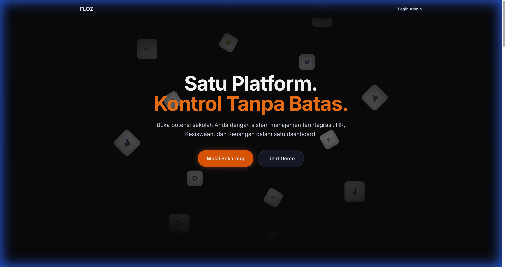
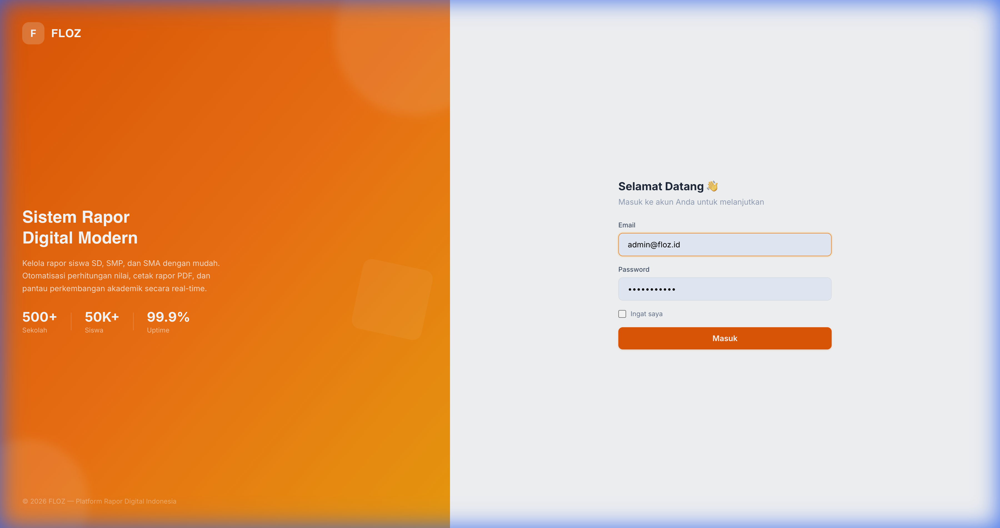

<p align="center">
  
</p>

<h1 align="center">FLOZ — Open Source Learning Management System</h1>

<p align="center">
  <strong>A modern, multi-tenant LMS built for Indonesian schools</strong>
</p>

<p align="center">
  
  
  
  
  
  
</p>

---

## ✨ Overview

**FLOZ LMS** is a production-ready, multi-tenant Learning Management System purpose-built for Indonesian educational institutions. It provides schools with a fully isolated environment to manage their academic operations — from student enrollment and grading to real-time announcements and per-session course management.

Each school (tenant) operates on its own database, ensuring complete data isolation while sharing a single codebase.

---

## 🚀 Key Features

### 🏫 Multi-Tenant Architecture
- One codebase, unlimited schools — each with isolated PostgreSQL databases
- Tenant identification via subdomain routing
- Centralized super admin panel for tenant management

### 👥 Role-Based Access Control (RBAC)
| Role | Capabilities |
|------|-------------|
| **Super Admin** | Tenant management, platform settings |
| **School Admin** | Full school management, staff, students, grades |
| **Teacher** | Courses, assignments, grading, attendance |
| **Student** | View courses, submit assignments, view grades |
| **Parent** | View child's academic progress *(planned)* |

### 📚 Course Management (Pertemuan System)
- **Per-Meeting Structure** — Courses organized into 16 sessions (Pertemuan 1–14 + UTS + UAS)
- **Material Management** — Upload files, attach links, or write text notes per meeting
- **Lock/Unlock Meetings** — Teachers control student visibility per session
- **Auto-Generated Sessions** — 16 meetings auto-created for every teaching assignment

### 📝 Unified Assignment System (Tugas)
- **Manual Assignments** — File upload submissions with teacher grading
- **Quiz Engine** — Multiple choice, true/false, and essay questions
- **Auto-Grading** — Objective questions graded automatically on submission
- **Per-Meeting Assignments** — Create assignments directly from course meetings

### 📊 Academic Management
- Class, subject, and academic year management
- Teaching assignment system linking teachers ↔ subjects ↔ classes
- Interactive schedule management with conflict detection
- Comprehensive gradebook supporting K-13 and Merdeka curriculum

### 📄 Report Cards
- Auto-generated PDF report cards
- Custom templates per school
- Student import via Excel/CSV

### 📢 Announcements & Notifications
- Rich-text editor with cover images and pinning
- Real-time notifications via **Laravel Reverb** (WebSocket)
- Targeted distribution by role

### 🔍 Audit Logging
- Full activity logging per tenant
- Tracks create/update/delete operations with user attribution

---

## 🛠️ Tech Stack

| Layer | Technology |
|-------|-----------|
| **Backend** | Laravel 12 (PHP 8.2+) |
| **Frontend** | Vue 3 + Inertia.js |
| **Styling** | Tailwind CSS |
| **Database** | PostgreSQL 16 |
| **Multi-tenancy** | Custom implementation (subdomain-based) |
| **Real-time** | Laravel Reverb (WebSocket) |
| **API Docs** | Swagger / OpenAPI |
| **Containerization** | Docker & Docker Compose |

---

## 📸 Screenshots

### Landing Page


### Login Portal


---

## ⚡ Quick Start

### Prerequisites
- PHP 8.2+ with `pgsql` extension
- PostgreSQL 16+
- Node.js 18+ & NPM
- Composer 2+

### Installation

```bash
# 1. Clone
git clone https://github.com/imnatann/floz-lms.git
cd floz-lms

# 2. Install dependencies
composer install
npm install

# 3. Environment
cp .env.example .env
php artisan key:generate

# 4. Database — configure .env with your PostgreSQL credentials, then:
php artisan migrate --seed          # Central database
php artisan tenants:migrate         # Tenant databases

# 5. Build frontend
npm run build
```

### Running Locally

You need **4 terminals** running simultaneously:

```bash
# Terminal 1 — Application Server
php artisan serve

# Terminal 2 — Reverb WebSocket Server
php artisan reverb:start

# Terminal 3 — Queue Worker
php artisan queue:listen

# Terminal 4 — Vite Dev Server
npm run dev
```

### Access

| URL | Description |
|-----|-------------|
| `http://localhost:8000` | Landing Page |
| `http://{tenant}.localhost:8000` | Tenant Portal |
| **Super Admin** | `admin@floz.id` / `password` |

---

## 📁 Project Structure

```
src/
├── app/
│   ├── Http/Controllers/
│   │   ├── Tenant/           # Tenant-scoped controllers
│   │   └── Platform/         # Super admin controllers
│   ├── Models/Tenant/        # Tenant models (Meeting, Assignment, etc.)
│   ├── Policies/Tenant/      # Authorization policies
│   └── Services/             # Business logic services
├── database/
│   └── migrations/
│       ├── tenant/           # Tenant-specific migrations
│       └── *.php             # Central migrations
├── resources/js/
│   ├── Pages/Tenant/         # Vue pages per feature
│   ├── Layouts/              # TenantLayout, PlatformLayout
│   └── Components/UI/        # Reusable UI components
└── routes/web.php            # All route definitions
```

---

## 🤝 Contributing

Contributions are welcome! Please feel free to submit a Pull Request.

1. Fork the repository
2. Create your feature branch (`git checkout -b feature/amazing-feature`)
3. Commit your changes (`git commit -m 'feat: add amazing feature'`)
4. Push to the branch (`git push origin feature/amazing-feature`)
5. Open a Pull Request

---

## 📄 License

This project is open-sourced software licensed under the [MIT License](https://opensource.org/licenses/MIT).

---

<p align="center">
  Made with ❤️ for Indonesian Education
</p>
